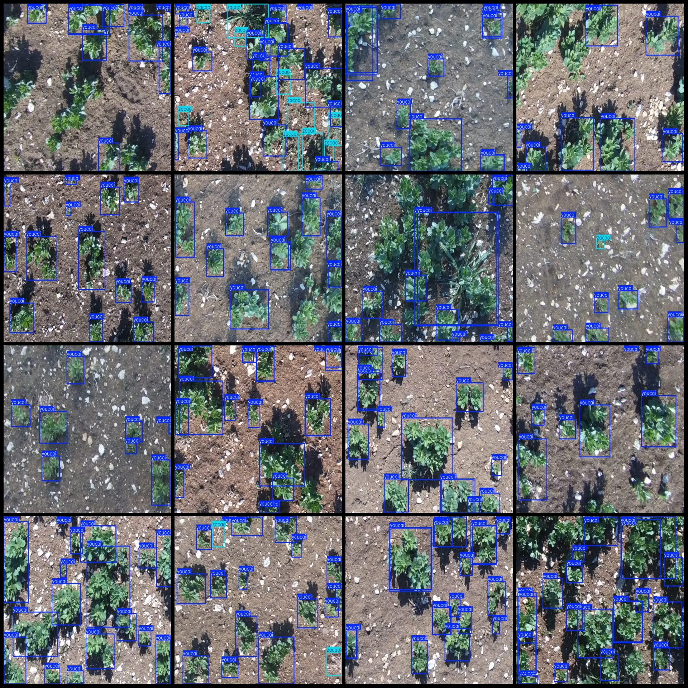
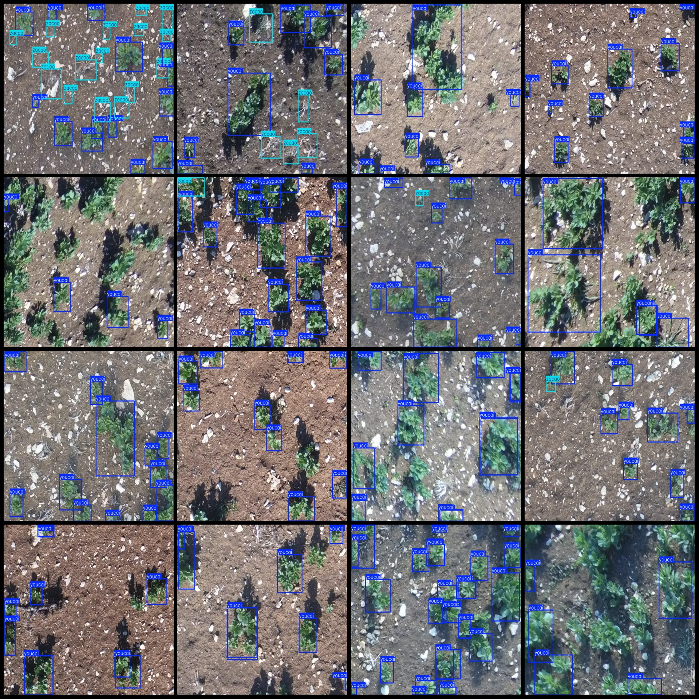
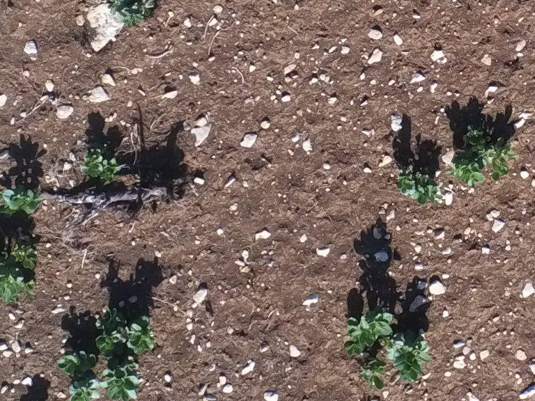

# Wheatfield Wheat and Weed Detection Dataset VOC+YOLO Format with 3146 Images in 2 Categories

Dataset Format: Pascal VOC format + YOLO format (txt file without split path, only containing jpg images along with corresponding VOC format xml files and yolo format txt files)
Number of Images (jpg file count): 3146
Number of Annotations (xml file count): 3146
Number of Annotations (txt file count): 3146
Number of Annotation Categories: 2
Labeling Categories Name (note that the order of labels in yolo format does not correspond to this, but is based on the classes.txt in the labels folder): ["youcai", "zacao"]
Number of Boxes per Category:
youcai (wheat seedlings) = 47227
zacao (weed) = 3504
Total Boxes = 50731
Number of Pictures per Category:
youcai (wheat seedlings) = 3146
zacao (weed) = 1165
Image Resolution: 768x576
Annotation Tool Used: labelImg
Annotation Rules: Draw rectangle boxes for categories
Important Note: The dataset does not have a split into training, validation, or test sets; users must divide it themselves.
Special Statement: This dataset does not guarantee the accuracy of models or weights files trained on it.
Image Preview:
Annotation Example:
Please note the clarity of the original image; all images should have similar clarity as these examples.

## Images

Here is a pay link on Stripe ( https://buy.stripe.com/3cs8yP7sY87d0vu9AB ). Please contact me lonlonago@foxmail.com after funding $89, and I will send you a complete data files , thank you!

